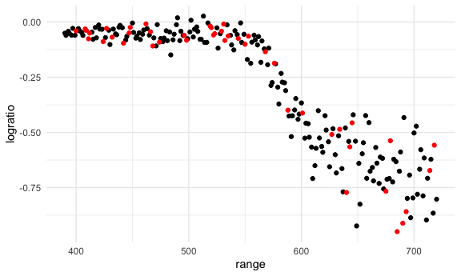
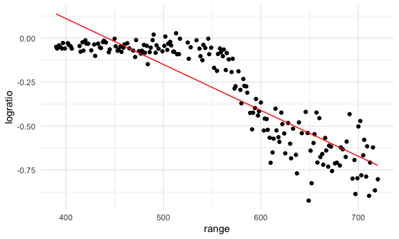
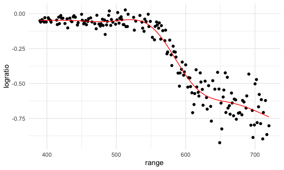
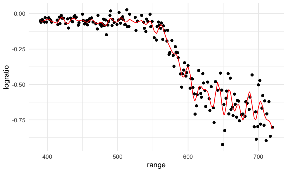
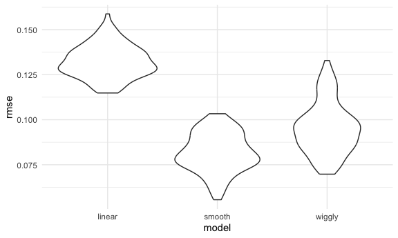
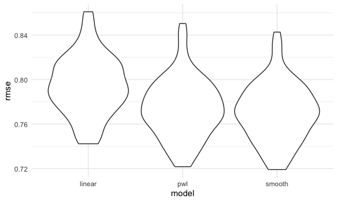

Cross Validation
================
Kallan Roan
2025-11-11

Libraries

``` r
library(tidyverse)
```

    ## ── Attaching core tidyverse packages ──────────────────────── tidyverse 2.0.0 ──
    ## ✔ dplyr     1.1.4     ✔ readr     2.1.5
    ## ✔ forcats   1.0.0     ✔ stringr   1.5.1
    ## ✔ ggplot2   3.5.2     ✔ tibble    3.3.0
    ## ✔ lubridate 1.9.4     ✔ tidyr     1.3.1
    ## ✔ purrr     1.1.0     
    ## ── Conflicts ────────────────────────────────────────── tidyverse_conflicts() ──
    ## ✖ dplyr::filter() masks stats::filter()
    ## ✖ dplyr::lag()    masks stats::lag()
    ## ℹ Use the conflicted package (<http://conflicted.r-lib.org/>) to force all conflicts to become errors

``` r
library(p8105.datasets)
library(modelr)
```

Preset settings

``` r
knitr::opts_chunk$set(
  fig.width = 6,
  fig.asp = .6,
  out.width = "90%"
)

theme_set(theme_minimal() + theme(legend.position = "bottom"))

options(
  ggplot2.continuous.colour = "viridis",
  ggplot2.continuous.fill = "viridis"
)

scale_colour_discrete = scale_colour_viridis_d
scale_fill_discrete = scale_fill_viridis_d
```

Load the LIDAR

``` r
data("lidar")
```

Look at the data

``` r
lidar
```

    ## # A tibble: 221 × 2
    ##    range logratio
    ##    <dbl>    <dbl>
    ##  1   390  -0.0504
    ##  2   391  -0.0601
    ##  3   393  -0.0419
    ##  4   394  -0.0510
    ##  5   396  -0.0599
    ##  6   397  -0.0284
    ##  7   399  -0.0596
    ##  8   400  -0.0399
    ##  9   402  -0.0294
    ## 10   403  -0.0395
    ## # ℹ 211 more rows

``` r
lidar_df = 
  lidar |> 
  mutate(
    id = row_number()
  )

lidar_df |> 
  ggplot(aes(x = range, y = logratio)) +
  geom_point()
```


## Create dataframes

``` r
train_df = 
  sample_frac(lidar_df, size = 0.8) |> 
  arrange(id)

test_df = 
  anti_join(lidar_df, train_df, by = "id")
```

Look at these

``` r
ggplot(train_df, aes(x = range, y = logratio)) +
  geom_point() +
  geom_point(data = test_df, color = "red")
```



Fit a few models to the `train_df`

``` r
linear_mod = lm(logratio ~ range, data = train_df)
smooth_mod = mgcv::gam(logratio ~ s(range), data = train_df) # fit a smooth function
wiggly_mod = mgcv::gam(logratio ~ s(range, k = 50), sp = 10e-8, data = train_df) # don't do this
```

Look at this

``` r
train_df |> 
  add_predictions(linear_mod) |> 
  ggplot(aes(x = range, y = logratio)) +
  geom_point() +
  geom_line(aes(y = pred), color = "red")
```



``` r
train_df |> 
  add_predictions(smooth_mod) |> 
  ggplot(aes(x = range, y = logratio)) +
  geom_point() +
  geom_line(aes(y = pred), color = "red")
```



``` r
train_df |> 
  add_predictions(wiggly_mod) |> 
  ggplot(aes(x = range, y = logratio)) +
  geom_point() +
  geom_line(aes(y = pred), color = "red")
```



Try computing our RMSEs

``` r
rmse(linear_mod, test_df)
```

    ## [1] 0.1454074

``` r
rmse(smooth_mod, test_df)
```

    ## [1] 0.08693724

``` r
rmse(wiggly_mod, test_df)
```

    ## [1] 0.1052501

## Iterate

``` r
cv_df = 
  crossv_mc(lidar_df, n = 100) |> 
  mutate(
    train = map(train, as_tibble),
    test = map(test, as_tibble)
  )
```

Did this work? Yes

``` r
cv_df |> 
  pull(train) |> 
  nth(1)
```

    ## # A tibble: 176 × 3
    ##    range logratio    id
    ##    <dbl>    <dbl> <int>
    ##  1   390  -0.0504     1
    ##  2   391  -0.0601     2
    ##  3   393  -0.0419     3
    ##  4   394  -0.0510     4
    ##  5   396  -0.0599     5
    ##  6   397  -0.0284     6
    ##  7   399  -0.0596     7
    ##  8   400  -0.0399     8
    ##  9   403  -0.0395    10
    ## 10   405  -0.0476    11
    ## # ℹ 166 more rows

Let’s fit models over and over

Alternative method. Longer code

``` r
lidar_lm = function(df) {
  
  lm(logratio ~ range, data = df)
}

cv_df |> 
  mutate(
    linear_fits = map(train, lidar_lm)
  )
```

    ## # A tibble: 100 × 4
    ##    train              test              .id   linear_fits
    ##    <list>             <list>            <chr> <list>     
    ##  1 <tibble [176 × 3]> <tibble [45 × 3]> 001   <lm>       
    ##  2 <tibble [176 × 3]> <tibble [45 × 3]> 002   <lm>       
    ##  3 <tibble [176 × 3]> <tibble [45 × 3]> 003   <lm>       
    ##  4 <tibble [176 × 3]> <tibble [45 × 3]> 004   <lm>       
    ##  5 <tibble [176 × 3]> <tibble [45 × 3]> 005   <lm>       
    ##  6 <tibble [176 × 3]> <tibble [45 × 3]> 006   <lm>       
    ##  7 <tibble [176 × 3]> <tibble [45 × 3]> 007   <lm>       
    ##  8 <tibble [176 × 3]> <tibble [45 × 3]> 008   <lm>       
    ##  9 <tibble [176 × 3]> <tibble [45 × 3]> 009   <lm>       
    ## 10 <tibble [176 × 3]> <tibble [45 × 3]> 010   <lm>       
    ## # ℹ 90 more rows

Do this

``` r
cv_df =
  cv_df |> 
  mutate(
    linear_fits = map(train, \(df) lm(logratio ~ range, data = df)),
    smooth_fits = map(train, \(df) mgcv::gam(logratio ~ s(range), data = df)),
    wiggly_fits = map(train, \(df) mgcv::gam(logratio ~ s(range, k = 50), sp = 10e-8, data = df))
  ) |> 
  mutate(
    rmse_linear = map2_dbl(linear_fits, test, rmse), #2 input lists, instead of 1 (map2 vs map)
    rmse_smooth = map2_dbl(smooth_fits, test, rmse),
    rmse_wiggly = map2_dbl(wiggly_fits, test, rmse)
  )
```

Let’s try to look at this better

``` r
cv_df |> 
  select(starts_with("rmse")) |> 
  pivot_longer(
    everything(),
    names_to = "model",
    values_to = "rmse",
    names_prefix = "rmse_"
  ) |> 
  ggplot(aes(x = model, y = rmse)) +
  geom_violin()
```



## Child growth

``` r
growth_df = 
  read_csv("data/nepalese_children.csv")
```

    ## Rows: 2705 Columns: 5
    ## ── Column specification ────────────────────────────────────────────────────────
    ## Delimiter: ","
    ## dbl (5): age, sex, weight, height, armc
    ## 
    ## ℹ Use `spec()` to retrieve the full column specification for this data.
    ## ℹ Specify the column types or set `show_col_types = FALSE` to quiet this message.

Weight v arm_c

``` r
growth_df |> 
  ggplot(aes(x = weight, y = armc)) +
  geom_point(alpha = 0.5)
```


Let’s show the models we might use

``` r
growth_df = 
  growth_df |> 
  mutate(
    weight_cp7 = (weight > 7) * (weight - 7)
  )
```

Let’s fit three models

``` r
linear_mod = lm(armc ~ weight, data = growth_df)
pwl_mod    = lm(armc ~ weight + weight_cp7, data = growth_df)
smooth_mod = mgcv::gam(armc ~ s(weight), data = growth_df)
```

``` r
growth_df |> 
  add_predictions(linear_mod) |> 
  ggplot(aes(x = weight, y = armc)) +
  geom_point(alpha = 0.5) +
  geom_line(aes(y = pred), color = "red")
```


``` r
growth_df |> 
  add_predictions(pwl_mod) |> 
  ggplot(aes(x = weight, y = armc)) +
  geom_point(alpha = 0.5) +
  geom_line(aes(y = pred), color = "red")
```


``` r
growth_df |> 
  add_predictions(smooth_mod) |> 
  ggplot(aes(x = weight, y = armc)) +
  geom_point(alpha = 0.5) +
  geom_line(aes(y = pred), color = "red")
```


Now cross validate

``` r
cv_df = 
  crossv_mc(growth_df, n = 100) |> 
  mutate(
    train = map(train, as_tibble),
    test = map(test, as_tibble)
  )
```

``` r
cv_df = 
  cv_df |> 
  mutate(
    linear_mod = map(train, \(df) lm(armc ~ weight, data = df)),
    pwl_mod    = map(train, \(df) lm(armc ~ weight + weight_cp7, data = df)),
    smooth_mod = map(train, \(df) mgcv::gam(armc ~ s(weight), data = df))
  ) |> 
  mutate(
    rmse_linear = map2_dbl(linear_mod, test, rmse),
    rmse_pwl    = map2_dbl(pwl_mod, test, rmse),
    rmse_smooth = map2_dbl(smooth_mod, test, rmse)
  )
```

Create boxplots

``` r
cv_df |> 
  select(starts_with("rmse")) |> 
  pivot_longer(
    everything(),
    names_to = "model", 
    values_to = "rmse",
    names_prefix = "rmse_") |> 
  mutate(model = fct_inorder(model)) |> 
  ggplot(aes(x = model, y = rmse)) + geom_violin()
```


